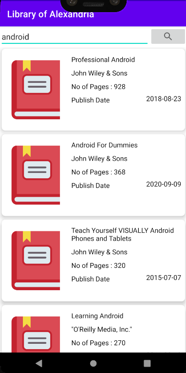
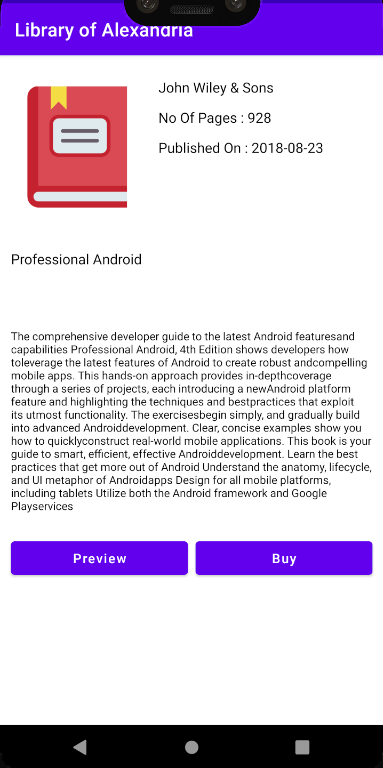

# Library-of-Alexandria-App 📚

## Description 🗒️
Android application which allows the user to search for any book, and displays the respective book details. Also provides the user with the link to preview or buy the book.  

### Main Activity - Search for any book

### Book details

### Link to Buy the book

## Tech stack 👨‍💻
Java, XML.

## Networking 🌩️
GoogleBooks API, Volley, JSON. 

## Tools 📱
Android Studio.
